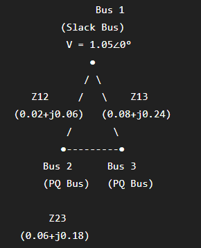
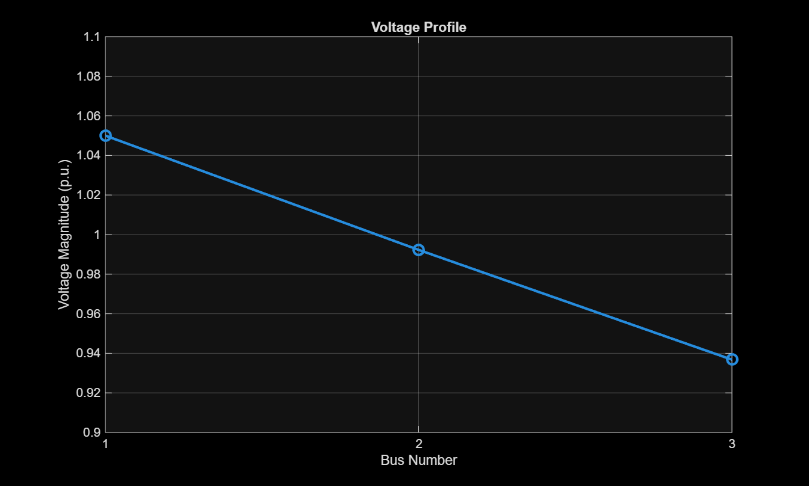
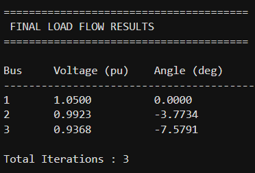

# ⚡ Power System Load Flow Analysis using Newton-Raphson Method


## 📖 Project Overview

Power Flow (Load Flow) Analysis is a fundamental study in power system engineering used to determine the steady-state operating condition of an electrical network. It calculates the voltage magnitude, voltage angle, active power flow, reactive power flow, and transmission losses for each bus in the system.

This project implements the **Newton-Raphson Load Flow Algorithm** in MATLAB for a 3-bus power system. The program automatically constructs the Y-Bus admittance matrix from transmission line data and iteratively solves the nonlinear power flow equations until convergence.

The project is designed with a modular architecture, making it easy to extend to larger IEEE test systems and additional load flow methods.

## ✨ Features

- Automatic Y-Bus matrix formation
- Newton-Raphson iterative load flow solver
- Bus voltage magnitude and angle calculation
- Line power flow computation
- Active and reactive power loss calculation
- Voltage profile visualization
- Automatic result export to text file
- Modular MATLAB implementation

- ## 📂 Repository Structure

```text
Power-System-Load-Flow-Analysis-using-Newton-Raphson
│
├── Codes
│   ├── main.m
│   ├── line_data.m
│   ├── create_ybus.m
│   ├── power_calculation.m
│   ├── jacobian.m
│   ├── newton_raphson.m
│   ├── line_flow.m
│   ├── voltage_profile.m
│   └── save_results.m
│
├── Images
│   ├── single_line_diagram.png
│   ├── voltage_profile.png
│   ├── ybus_matrix.png
│   ├── bus_results.png
│   └── line_flow_results.png
│
├── Results
│   └── load_flow_results.txt
│
├── LICENSE
├── README.md
└── CHANGELOG.md
```

## ⚡ System Model

The implemented test system consists of a three-bus transmission network with one slack bus and two load (PQ) buses. The transmission lines are modeled using their series impedance, from which the Y-Bus admittance matrix is automatically constructed.

<p align="center">

</p>

## 📐 Mathematical Background

The Newton-Raphson method solves the nonlinear power flow equations iteratively.

### Active Power

\[
P_i=\sum_{j=1}^{n}|V_i||V_j|
(G_{ij}\cos\theta_{ij}+B_{ij}\sin\theta_{ij})
\]

### Reactive Power

\[
Q_i=\sum_{j=1}^{n}|V_i||V_j|
(G_{ij}\sin\theta_{ij}-B_{ij}\cos\theta_{ij})
\]

The Jacobian matrix is used to update bus voltage magnitudes and voltage angles until the specified convergence tolerance is achieved.

## ⚙️ Algorithm Workflow

1. Read transmission line parameters.
2. Construct the Y-Bus matrix.
3. Initialize bus voltage magnitudes and angles.
4. Compute active and reactive power mismatches.
5. Form the Jacobian matrix.
6. Update voltage magnitudes and voltage angles.
7. Repeat until convergence.
8. Calculate line power flow and transmission losses.
9. Plot the voltage profile.
10. Export the results.

## 🚀 Getting Started

### Prerequisites

- MATLAB R2020a or later

### Run the Project

```matlab
cd Codes
main
```

The simulation automatically:

- Constructs the Y-Bus matrix
- Solves the load flow problem
- Computes line power flow
- Calculates transmission losses
- Generates the voltage profile
- Saves the results to `Results/load_flow_results.txt`

- ## 📊 Results

The implementation successfully computes:

- Bus voltage magnitudes
- Voltage angles
- Line active power flow
- Line reactive power flow
- Active and reactive transmission losses
- Voltage profile

The Newton-Raphson algorithm converges within a few iterations for the implemented test system.

## 🖼️ Output Screenshots

### Voltage Profile

<p align="center">

</p>

---

### Y-Bus Matrix

<p align="center">

</p>

---

### Bus Voltage Results

<p align="center">

</p>

---

### Line Flow Results

<p align="center">

</p>

## 👨‍💻 Author

**Anurag Choudhary**

B.Tech in Electrical Engineering  
Indian Institute of Technology (ISM) Dhanbad

If you found this project helpful, consider giving it a ⭐ on GitHub.
